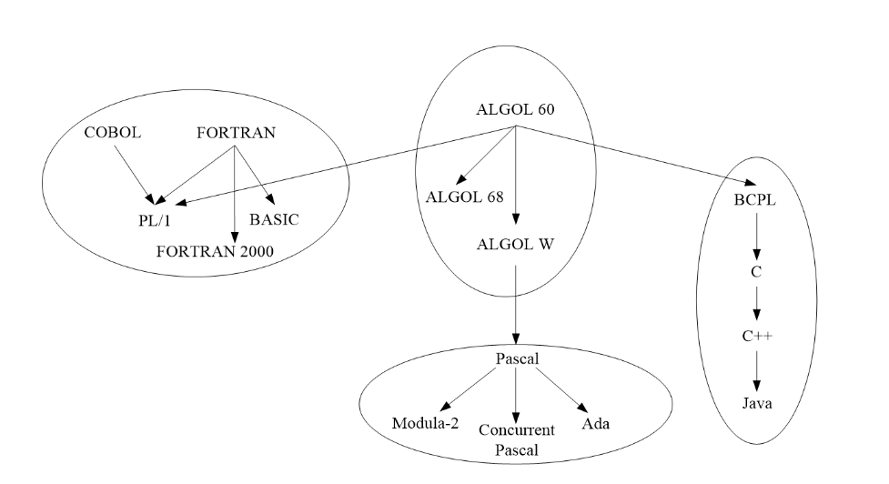
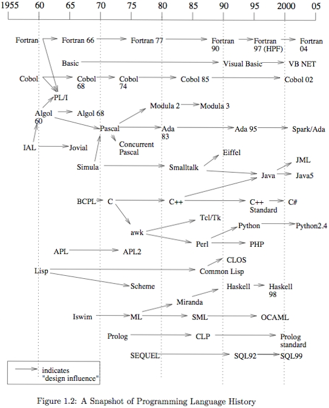

# **第一章   绪论**
      本章讨论程序设计语言中的一些重要概念，为深入了解程序设计语言打下基础。
      简介程序设计语言的发展历史。 
## **1.1  引言**<br><br>
### **1. 程序设计语言的产生**<br><br>

        语言是人们交流思想的工具。人类在长期的历史发展过程中，为了交流思想、表达感情和交换信息，逐步形成了语言----自然语言。
        程序设计语言:人工语言

* **程序设计语言（programming  language）**

    程序设计语言是一组规则，包括：

    **1）字母表**  
    > 程序中可以使用的符号,包括字母，数字，分隔符。如 "a-z  A-Z   0-9 * /  {} [] ; , ' " 等

    **2）词法规则**
    > 合法的单词符号（词元/token）的形成规则

    >C语言单词符号token包括：关键字  struct、 标识符  count、 运算符 -> &  、常量  、分隔符 {} 等

    **3）语法规则**
    > 语法单位的形成规则
    
    > C语言语法单位包括： 表达式、语句、函数、程序 

    **4）语义规则**
    > 单词符号和语法单位的含义规则

    **5) 语用规则**
    > 语义规则的发展和延伸

    > 强调在一定的语境中使用单词和语法单位时体现出来的具体意义；要根据上下文（即前、后内容）明确单词和语法单位的具体意义

    **6）其他规则**
    > 包括类型使用规则，参数传递规则，作用域规则等。

* **关键字 标识符  运算符 常量  分隔符**

    ```c
    // Recursive 
    long long fibb(long long a, long long b, int n) {
        return (--n>0)? (fibb(b, a+b, n)):(a);
    }
    // Iterative  
    long long int fibb(int n) {
        int fnow = 0, fnext = 1, tempf;
        while(--n>0){ 		tempf = fnow + fnext;
            fnow = fnext;
            fnext = tempf;
            }
            return fnext;	
    }
    ```
### **2. 程序设计语言的发展**<br><br>
        计算机程序设计语言的发展，经历了从机器语言、汇编语言到高级语言的历程。
        
* **机器语言→汇编语言→高级语言**

    > 用**机器语言**编写的程序由二进制指令组成，计算机可以直接执行。<br>
    将机器语言符号化，产生了**汇编语言**。 
     
    > **对于机器语言和汇编语言**<br>
    指令的操作码与功能、指令格式、寻址方式、数据格式等，不同的计算机有不同的规定。<br>
    与机器有关的语言，通常称为**低级语言**。<br>
    与机器无关的程序设计语言，通常称为**高级语言**。

    > **高级语言的特点**<br>
    ①直观、自然、易于理解<br>
    ②易读，易写，易于交流、存档<br>
    ③一般都是独立于机器的,易于移植

### **3. 翻译：等价的变换**<br><br>
        计算机只可直接执行用机器语言编写的程序。
        而用汇编语言和高级语言编写的程序，机器不能直接执行必须将它们翻译成完全等价的机器语言程序才能执行

> **汇编程序（汇编器 Assembler）**
    将汇编语言程序翻译为机器语言程序的程序

>  **编译程序（编译器 Compiler）**
    将高级语言程序翻译为低级语言程序的程序

>  编写一个高级语言的编译器的工作，通常称为对这个语言的实现。

### **4. 解释与编译**<br><br>
        早期 BASIC 不是编译执行，而是对源程序进行解释（分析），直接计算出结果。
        需要解释程序（解释器 interpreter）支持
> 早期的LISP，ML，Prolog和Smalltalk均是 解释型的语言。 

> 现在部分语言同时有 编译/解释 执行方式。

> 早期的Java实现中字节码一种解释型语言。
   Java源代码编译产生字节码的中间代码，在Java虚拟机解释执行。目前虚拟机都支持JIT即时编译。
### **5. REPL（Read Eval Print Loop）**<br><br>
        解释执行特别适合于动态语言和交互式环境，便于人机对话。
        解释器边翻译边解释执行，重复执行的语句需要重复翻译，比编译执行要花去更多的时间，执行效率较低。 
 
> python fsharp haskell


> 与编译有关的三种语言、三种程序<br>
    源语言、工具语言、目标语言<br>
    源程序、编译程序、目标程序

> 高级语言涉及的三类人<br>
    设计者、实现者、使用者<br>

> 传统的目标语言通常是低级语言，但是最近JavaScript成为的重要的目标语言之一     

## **1.2 命令式语言**<br><br>
### **1. 程序设计语言的分类**<br><br>

> 按设计的理论基础分为4类语言<br> 
> **命令式语言**：基础是冯·诺依曼模型<br>
> **函数式语言**：基础是数学函数(函数运算)<br>
> **逻辑式语言**：基础是数理逻辑、谓词演算<br>
> **对象式语言**：基础是抽象数据类型<br> 

> 按语言的发展进程分类   
> **低级语言**<br>
    &emsp;（机器语言） 01010101<br>
    &emsp;（汇编语言）  MOV SUB LOAD<br>
> **高级语言** <br>
    &emsp;命令式、过程式<br>
    &emsp;说明式语言<br>
    &emsp;函数式、逻辑式语言<br>

### **2. 冯.诺依曼体系结构（模型）**<br><br>

* **基础**<br>
   存储器，控制器，处理器，PC（程序计数器）

* **特点**<br>
    * 数据、指令以二进制形式存储;
    * 存储程序的工作方式；
    * 程序顺序执行；可强制修改执行顺序
    * 存储器的内容可以被修改。

* **在命令式语言上的表现**
    * **变量** 
    存储单元及名称由变量的概念代替。变量可以代表一个或一组单元。 
    * **赋值** 
    存储计算结果。
    * **重复** 
    语句顺序执行,指令存储在有限的存储器中,完成复杂计算时需要重复执行某些指令序列。

### **3. 绑定（Binding）概念**<br><br>
* **实体**：程序的组成部分，如变量，表达式、程序单元等。
* **属性**：实体具有的特性。
* **绑定**：实体与其各种属性建立起联系的过程称为绑定，实际上就是建立了某种约束。
* **描述符**：描述实体属性的表格。
<br><br>

* **静态和动态特性**
    * 编译时能确定的特性--**静态特性**
    * 运行时才能确定的特性--**动态特性**    
    <br>

* **绑定**
    * **静态绑定**<br>绑定在运行之前(即编译时)完成，且在运行时不会改变
    * **动态绑定**<br>绑定在运行时完成

### **3. 变量**<br><br>
        变量是对一个或若干个存储单元的抽象
        一个变量至少占用一个存储单元；一个存储单元至少一个字节（也可以为2个字节、 4个字节…）
        变量用名字来标识;变量也可以不具有名字--匿名变量。
        赋值是对修改存储单元内容的抽象
        变量的4个属性：作用域、生存期、值、类型


> <br> **变量的作用域：** 可以访问该变量的程序范围。<br> <br> 

* **静态作用域绑定：** 按照程序的结构定义变量的作用域（C语言等）。又被称为 **词法作用域**

* **动态作用域绑定：** 按照程序的执行动态地定义变量的作用域（SNOBL4 语言等）。早期的Lisp实现是动态作用域，后来改为静态作用域。

* 目前绝大多数语言只支持**静态作用域**，少数支持两种作用域。

> <br> **变量的生存周期：** 存储区绑定于一个变量的时间区间。<br> <br> 

* **编译阶段**   数据由变量和常量表示

* **运行阶段**   数据由**数据对象**表示

    * **数据对象**表示存储区和它保存的值。

    * 变量获得存储区的活动称为**分配**。

    * 变量分配的存储单元的个数--**变量长度**。

    <br>
* 运行前分配变量存储区--**静态分配**（FORTRAN语言）

* 运行时分配变量存储区--**动态分配**（C 、C++语言）
   * 动态分配通过两种**途径**来实现：
        * 用相关的语句显式提出请求（new）
        * 运行变量所对应的程序单元时自动分配。
* 分配原则，由语言(设计者)规定。
    <br>

> <br> **变量的值：** 存储区单元的内容。<br><br> 

* 变量在生存期内绑定于一个存储区，该存储区中的内容以**二进制**编码方式表示的变量值，并绑定于变量。

* 值按变量所绑定的**类型**来进行解释。

* **访问匿名变量**的基本方法是通过**访问路径**来实现的。

*  变量的值在程序运行时可以通过赋值操作来修改，因此，变量与它的值的绑定是**动态**的。

*  常数（量）的值不能修改。

* **初始值问题**

    * 变量获得所分配的存储区，完成变量与存储区的绑定。此时，该变量绑定的值是什么呢？即变量初始化问题。
        
    * 不同的语言有不同的规则
        * 不初始化则出错
        * 随机
        * 缺省值0

> <br> **变量的类型**<br><br> 

1. **与变量相关联的值，以及对这些值进行的操作的抽象。**

* 类型可用来解释变量绑定的存储区的内容（二进制编码）的意义；

* **语言定义**时，**类型**绑定于**值和操作**；

* **语言实现**时，**值和操作**绑定于**某种机器二进制表示**。

2. **变量类型可以静态或动态地进行绑定**

* **静态绑定**：通过说明语句完成

* **动态绑定**：执行时**隐式**说明，且动态变化
* **动态绑定**的语言实现采用**解释**方式处理更合适，因为对于一个不能确定变量类型的表达式，在运行之前没有足够的信息来生成合适的代码。
* 语言实现采用编译还是解释方式，受到变量与类型绑定规则的严重影响。

* 不少新的语言同时提供 编译器和解释器
    * Fsharp Haskell   
    * C# interactive shell 

* 一般而言：
    * **静态绑定**语言是面向**编译**的语言。
    * **动态绑定**语言是面向**解释**的语言。
  
* 动态类型绑定的语言又称为动态语言。

### **5. 虚拟机：软件实现的机器**<br><br>
* M1是实际的机器，汇编语言程序要在M1和汇编程序上执行，
         <center>M1+汇编程序=M2</center>

* 虚拟机M2的机器语言是汇编语言
         <center>M2+编译程序=M3</center>

* 虚拟机M3以高级语言为机器语言（对用户而言）

* 虚拟机是由实际机器加软件实现的机器。
  >若一台实际机器配置上Python语言解释程序，对用户来说，这台机器就是Python语言的虚拟机（Python语言机）。

### **6. 主要的命令式语言及其关系**<br><br>

## **1.3 程序单元**<br><br>

1. **(程序)单元**<br>
    程序执行过程中的被独立调用单元：子程序，分程序，过程等。

2. **单元表示**<br>
   编译时，单元表示为单元的源程序。<br>
   运行时，单元表示由一个代码段和一个活动记录组成，称为**单元实例**。

3. **活动记录**<br>
    执行单元需要的信息，及该单元的局部变量的存储区。

4. **非局部变量**<br>
    一个程序单元可以引用未被本单元说明而被其它单元说明的变量。

5. **全局变量**<br>
    在一个程序中，各个程序单元都可以引用的变量。

6. **引用环境**<br>
    一个程序单元U可以引用的局部变量、非局部变量和全局变量。<br>
    * 局部变量绑定于存储在U的当前活动记录中的数据对象，称为**局部环境**。
    * 非局部变量绑定于别的（说明该非局部变量）程序单元的活动记录或全局数据区中的数据对象，称为**非局部环境**。

    **以C语言为例**
    * C程序运行时的存储空间：<br>
    （1）程序代码区：<br>
    存储程序代码（编译后形成的二进制机器指令序列）<br>
    （2）数据静态存储区：<br>
    存储程序的常量数据、全局数据和static数据。<br>
    （3）数据动态存储区：<br>
        * 活动记录(栈)：返回地址、CPU现场、形参、局部变量、临时变量
        * 存储动态内存申请数据(堆)

7. **别名**<br>
    同一单元的引用环境中有两个或多个变量绑定于同一数据对象，称这些变量具有别名。

8. **副作用**<br>
    对一个非局部变量的进行修改。

## **参考**<br>
    各种语言的重要思想起源
* http://rosettacode.org/wiki/Category:Programming_Languages
* https://en.wikipedia.org/wiki/Programming_language
* https://en.wikipedia.org/wiki/History_of_programming_languages
* Masterminds of Programming ,Conversations with the Creators of Major Programming Languages 



## **论述题**<br>
        请选择一个比较新的语言，从其特点，应用领域，分析其历史（受哪些语言影响），写一份文档。
        文档应包括该语言写出数个体现其特点的程序片段（可以包括你的实际运行截图）。
